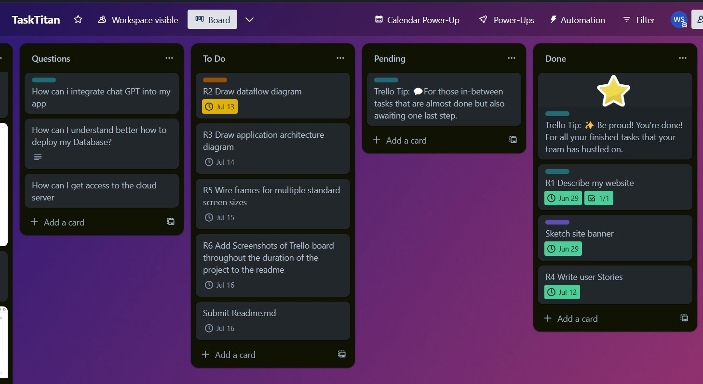

## TASK TITAN Full stack application Part A

### R1: Website descriprion

Purpose:
The electrical contractor Wolf Electrical Enterprises Pty.Ltd
asked me to develop a platform for customers to initiate and track electrical trade jobs, the management than can provide a quote and after customer acceptance assign the job to the right workers and track their progress.  After the customer is satisfied with the work and signes off the job there is an option to leave a review.

Target Audience:
Trade  enterprises, customers, workers
If successfull this app can be easily adjusted to other trades and enterprises.

Features:

The app has the following core features:
* User Authentication: This includes user sign up with email verification, user sign in, and JWT authentication. This is a fundamental feature for any platform that handles user data.

* User Roles and Views: Different views for the business owner/manager, workers, and customers. This feature is crucial for providing a customized user experience based on the role of the user.

* Job Management: This includes the ability for customers to initiate new jobs and request quotes, for managers to quote on jobs and assign workers, and for workers to accept jobs and mark them as completed. This is the primary functionality of your platform.

* Notification System: Notifications for new jobs, job assignments, changes in job status, and new reviews. This feature is important for keeping all parties informed about the progress of jobs.

* Review System: The ability for customers to sign off on jobs and leave reviews. This feature is important for quality control and for providing feedback to workers.

* Search and Filter: The ability to search and filter jobs, tradespeople, or reviews. This feature is necessary for users to easily navigate and find specific information on the platform.

### In Detail: 
User sign up with email verification
User sign in
JWT authentication
Encrypted password (bcrypt + salted) stored in database
The app has a seperate view for Manager, tradies and customers
### Functions for Business owner/ manager: 
* Gets notification when new job and quote requested by customer
* see all open jobs
* Quote on jobs
* Gets notification when quote accepted by customer
* can assign a worker to the job and add comment or refine job description
* Gets notification when job completed by worker
* review and close job
### Functions for worker
* Gets notification when new job assigned
* Worker can accept job
* Worker can mark job as completed
* can see all jobs assigned to him
### Functions for customer
* Can raise new job and request quote
* Gets notification when quote issued
* Customer can accept quote, give go ahead
* Customer can sign off on job and leave a rview.

### General functions: 
* Notification System: The platform can send notifications to users about important updates, such as new job postings, job assignments, changes in job status, and new reviews.
* Search and Filter: The platform can include a search and filter feature, allowing users to easily find specific jobs, tradespeople, or reviews. 
For example as the manager I want to see all jobs done for a specific customer or by a specific tradie.
Or I want to see all reviews for the work of a specific tradie.

* Users must log in to lodge a job or add a new Job or review. Jobs can be canceled by the user who posted them or admin.

* Admin can view all users.

* Users can update their own details and delete their own accounts.

### Nice to have:
* Connect the app to google and facebook and publish the reviews on the business profiles
(I have had a service like that by Block (Former Square) I need to research if there are APIs available)

### Tech Stack

react, axios, expres.js, mongoose, multer, bcryptjs, jsonwebtoken 

### R2: Dataflow diagram

### R3: Application Architecture Diagram

### R4: User Stories for each of the core features

#### 1. User Profile Creation and Authentication

**Persona**: As a new user (Alice, a 40-year-old homeowner who needs electrical work done)

**What**: I want to be able to create a personal profile, sign up with email verification, and then sign in securely.

**Why**: So that I can customize my experience, keep track of my activities within the app, access the platform, and ensure my account is secure.

**Acceptance Criteria**:

- When I open the app for the first time, I should be prompted to create a new profile.
- I should be able to enter my name, email address, and create a password.
- I should have the option to add a profile picture.
- I should be able to save my profile and view it.
- I should receive a confirmation email once my profile is successfully created.
- I should be able to edit my profile information at any time.
- Successful sign up with email verification, secure sign in with JWT authentication.

#### 2. User Roles and Views

   **Persona**: As a business owner (Bob, a 50-year-old electrical contractor)

   **What**: I want to have a different view and capabilities in the app compared to workers and customers.

   **Why**: So that I can manage jobs, quotes, and assignments effectively.

   **Acceptance Criteria**: Successful differentiation of views and capabilities based on user roles.

#### 3. Job Management

   **Persona**: As a customer (Alice, a 40-year-old homeowner)

   **What**: I want to be able to initiate new jobs and request quotes.

   **Why**: So that I can get my electrical work done.

   **Acceptance Criteria**: Successful creation of new jobs and request for quotes.

#### 4. Notification System

   **Persona**: As a worker (Charlie, a 30-year-old electrician)

   **What**: I want to receive notifications when new jobs are assigned to me and when their status changes.

   **Why**: So that I can stay updated on my work assignments.

   **Acceptance Criteria**: Successful receipt of notifications about job assignments and status changes.

#### 5. Review System

   **Persona**: As a customer (Alice, a 40-year-old homeowner)

   **What**: I want to be able to sign off on completed jobs and leave reviews.

   **Why**: So that I can provide feedback on the work done.

   **Acceptance Criteria**: Successful sign off on completed jobs and submission of reviews.

#### 6. Search and Filter

   **Persona**: As a business owner (Bob, a 50-year-old electrical contractor)

   **What**: I want to be able to search and filter jobs, tradespeople, or reviews.

   **Why**: So that I can easily find specific information on the platform.

   **Acceptance Criteria**: Successful search and filter of jobs, tradespeople, or reviews.

### R5: Wireframes

### R6: Screenshots Of Trello board

### [Trello board](https://trello.com/b/95B4bXrR/tasktitan)

